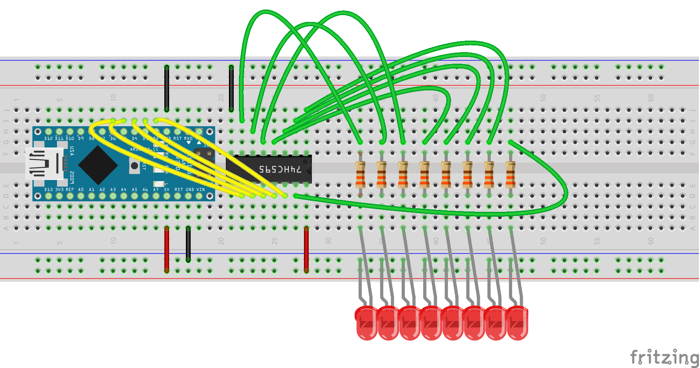
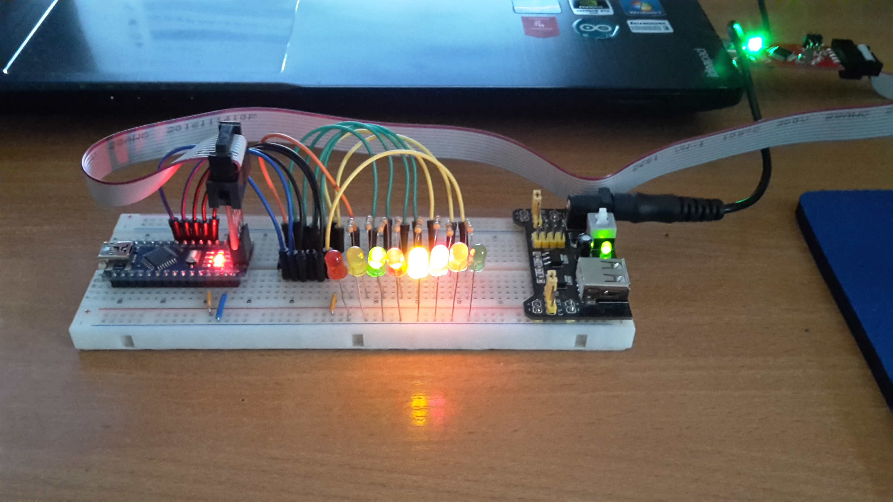

# 001_74HC595_SHIFT_REGISTER

In this example I use 74HC595 shift register to control 8 led diodes, but using this lib you can control a huge number of leds, you just need to connect your shift registers in series. Only 5 GPIO pins are used. I use a Arduino Nano board as development board. The clones are really cheap and they have everything you need. 

